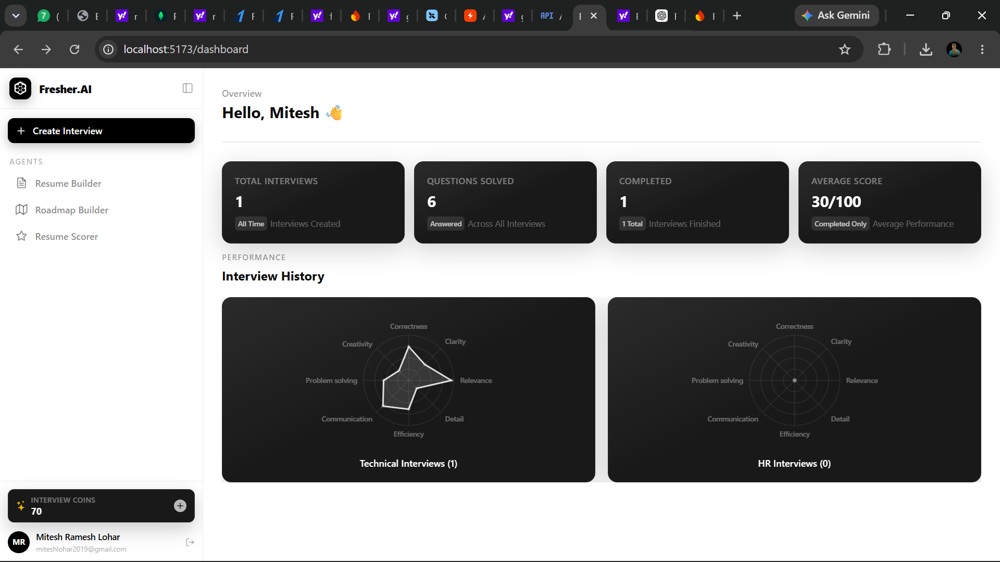
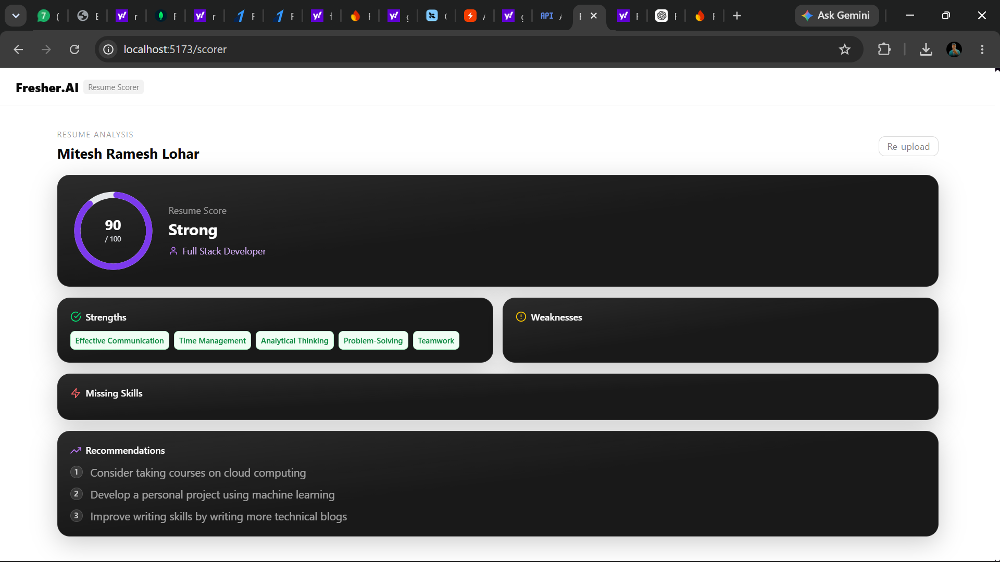
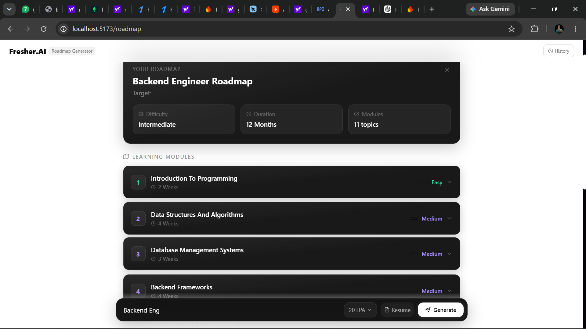
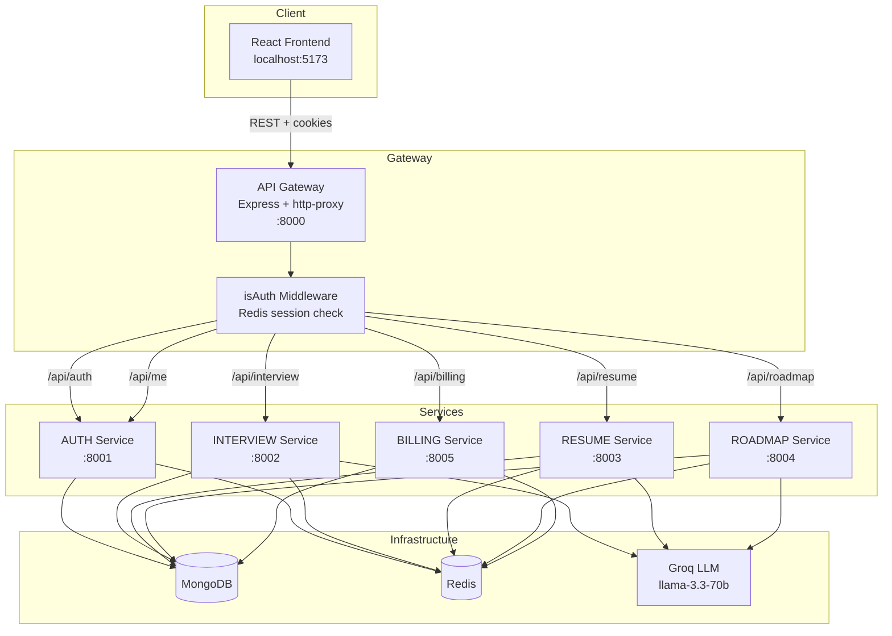

# Fresher.AI

> **Job interviews don't have to suck anymore.**

Fresher.AI is an AI-powered interview preparation platform built for job seekers and freshers. It combines **multi-agent AI**, **real-time mock interviews**, **ATS resume analysis**, and **personalized career roadmaps** in one clean, modern web app.

The platform runs as a **microservice architecture** — a React frontend talks to an Express **API Gateway** that routes to five independent services (auth, interview, resume, roadmap, billing). AI agents are orchestrated with **LangGraph**, powered by **Groq's LLM**, with **MongoDB** for persistence and **Redis** for caching & sessions.

---

## ✨ Features

| Feature | Description |
| --- | --- |
| 🎤 **AI Mock Interviews** | HR & Technical interviews generated by AI, question-by-question with difficulty levels, countdown timers, and per-answer feedback. |
| 📊 **Detailed Reports** | After each interview, receive an overall score, strengths, weaknesses, and actionable recommendations. |
| 📄 **Resume Builder** | Step-by-step resume builder with a live preview and PDF export. |
| 🧠 **ATS Resume Analysis** | Upload a PDF resume and get an ATS score (0–100), skill extraction, missing-skills detection, and improvement tips. |
| 🗺️ **Roadmap Generator** | AI-generated, module-based learning roadmaps for your target role and expected package (LPA), optionally personalized from your resume. |
| 📈 **Analytics Dashboard** | Track interview stats and visualize technical vs. behavioural skill scores. |
| 🔐 **Google Sign-In** | Seamless authentication via Firebase + session management. |
| 🪙 **Coin-based Monetization** | Free users start with 150 interview coins; upgrade via a Starter plan (₹199 / 300 coins) powered by Razorpay. |

---

## 📸 Screenshots

| Landing Page | Resume Analysis | Roadmap Generator |
| --- | --- | --- |
|  |  |  |

---

## 🧰 Tech Stack

### Frontend
| Technology | Purpose |
| --- | --- |
| [React 19](https://react.dev/) + [Vite](https://vitejs.dev/) | UI framework & build tool |
| [Tailwind CSS 4](https://tailwindcss.com/) | Styling |
| [Redux Toolkit](https://redux-toolkit.js.org/) | State management |
| [React Router 7](https://reactrouter.com/) | Routing |
| [Firebase](https://firebase.google.com/) | Google authentication |
| [Recharts](https://recharts.org/) | Charts & analytics |
| [jsPDF](https://github.com/parallax/jsPDF) / [html2canvas](https://html2canvas.hertzen.com/) / [react-to-print](https://github.com/gregnb/react-to-print) | Resume preview & export |
| [Motion](https://motion.dev/) | Animations |
| [Monaco Editor](https://microsoft.github.io/monaco-editor/) | Code editor component |

### Backend
| Technology | Purpose |
| --- | --- |
| [Node.js](https://nodejs.org/) + [Express 5](https://expressjs.com/) | API services |
| [LangGraph](https://www.langchain.com/langgraph) | AI agent orchestration |
| [Groq](https://groq.com/) (Llama 3.3 70B) | LLM inference |
| [MongoDB](https://www.mongodb.com/) + [Mongoose](https://mongoosejs.com/) | Database |
| [Redis](https://redis.io/) + [ioredis](https://github.com/redis/ioredis) | Caching & session store |
| [Firebase Admin](https://firebase.google.com/docs/admin/setup) | ID token verification |
| [Razorpay](https://razorpay.com/) | Payments |
| [pdf-parse](https://www.npmjs.com/package/pdf-parse) | Resume PDF text extraction |

---

## 🏗️ Architecture

The system follows a **microservice pattern** behind a single API Gateway:



### How it works

1. The browser authenticates with **Google via Firebase** and sends the ID token to the auth service.
2. Auth creates a **Redis-backed session** and sets an `httpOnly` cookie.
3. The **API Gateway** validates every request through `isAuth`, injects the `x-user-id` header, and proxies to the target microservice.
4. **LangGraph workflows** orchestrate specialized AI agents:
   - **Interview** → `interviewAgent` (generates questions) → `feedbackAgent` (scores answers across 8 dimensions) → `summaryAgent` (produces the final report).
   - **Roadmap** → `roadmapAgent` (builds a module-based study plan) → `resourceAgent` (appends learning resources).
5. Each service caches hot data in **Redis** (interviews list, resumes, roadmaps) to reduce database load.

### Microservices overview

| Service | Port | Responsibility |
| --- | --- | --- |
| **Gateway** | `8000` | Auth middleware, routing, user context propagation |
| **Auth Service** | `8001` | Firebase Google login, session management, interview coins |
| **Interview Service** | `8002` | AI mock interviews, per-answer feedback, reports |
| **Resume Service** | `8003` | PDF upload, ATS parsing & scoring |
| **Roadmap Service** | `8004` | Personalized learning roadmap generation |
| **Billing Service** | `8005` | Razorpay orders & payment verification |

---

## 🚀 Getting Started

### Prerequisites

- [Node.js](https://nodejs.org/) ≥ 18
- [Docker](https://www.docker.com/) (for Redis)
- A MongoDB cluster (local or Atlas)
- Accounts / keys for: **Groq**, **Firebase**, **Razorpay** (test mode), and **YouTube Data API**

### 1. Clone & install dependencies

```bash
git clone <your-repo-url>
cd fresherAI

# Frontend
cd frontend
npm install

# Backend (each service has its own package.json)
cd ../backend/gateway && npm install
cd ../services/auth-service && npm install
cd ../services/interview-service && npm install
cd ../services/resume-service && npm install
cd ../services/roadmap-service && npm install
cd ../services/billing-service && npm install
```

### 2. Start Redis

```bash
cd backend
docker compose up -d
```

### 3. Configure environment variables

Create a `.env` file inside each service using the variable names below (values shown are **examples**, not real credentials).

#### `backend/gateway/.env`

```env
PORT=8000
AUTH_SERVICE_URL=http://localhost:8001
INTERVIEW_SERVICE_URL=http://localhost:8002
RESUME_SERVICE_URL=http://localhost:8003
ROADMAP_SERVICE_URL=http://localhost:8004
BILLING_SERVICE_URL=http://localhost:8005
```

#### `backend/services/auth-service/.env`

```env
PORT=8001
MONGODB_URL=mongodb://localhost:27017/fresherai
REDIS_URL=redis://localhost:6379
# Plus a Firebase Admin serviceAccountKey.json placed in the service root
```

#### `backend/services/interview-service/.env`

```env
PORT=8002
MONGODB_URL=mongodb://localhost:27017/fresherai
REDIS_URL=redis://localhost:6379
GROQ_API_KEY=your_groq_api_key
```

#### `backend/services/resume-service/.env`

```env
PORT=8003
MONGODB_URL=mongodb://localhost:27017/fresherai
REDIS_URL=redis://localhost:6379
GROQ_API_KEY=your_groq_api_key
```

#### `backend/services/roadmap-service/.env`

```env
PORT=8004
MONGODB_URL=mongodb://localhost:27017/fresherai
REDIS_URL=redis://localhost:6379
GROQ_API_KEY=your_groq_api_key
YOUTUBE_API_KEY=your_youtube_data_api_key
```

#### `backend/services/billing-service/.env`

```env
PORT=8005
MONGODB_URL=mongodb://localhost:27017/fresherai
REDIS_URL=redis://localhost:6379
RAZORPAY_KEY_ID=rzp_test_xxxxxxxxxxxx
RAZORPAY_KEY_SECRET=your_razorpay_key_secret
```

#### `frontend/.env`

```env
VITE_FIREBASE_APIKEY=your_firebase_web_api_key
VITE_RAZORPAY_KEY_ID=rzp_test_xxxxxxxxxxxx
```

> **Security note:** `serviceAccountKey.json`, `.env` files and API keys are already git-ignored. Never commit real credentials.

### 4. Run the backend services

Open separate terminals and start each service (the order doesn't strictly matter):

```bash
# Gateway (port 8000)
cd backend/gateway
npm run dev

# Services
cd backend/services/auth-service      && npm run dev
cd backend/services/interview-service && npm run dev
cd backend/services/resume-service    && npm run dev
cd backend/services/roadmap-service   && npm run dev
cd backend/services/billing-service   && npm run dev
```

### 5. Run the frontend

```bash
cd frontend
npm run dev
```

Open **http://localhost:5173**, sign in with Google, and start preparing for interviews.

---

## 📡 API Overview

All routes (except `/api/auth/login`) are protected by the gateway's `isAuth` middleware.

| Method | Endpoint | Service | Description |
| --- | --- | --- | --- |
| `POST` | `/api/auth/login` | Auth | Exchange Firebase ID token for a session cookie |
| `POST` | `/api/auth/logout` | Auth | Destroy the session |
| `POST` | `/api/auth/coins/use` | Auth | Deduct interview coins |
| `POST` | `/api/auth/coins/add` | Auth | Add interview coins |
| `GET` | `/api/me` | Auth | Get the current user |
| `POST` | `/api/interview/start` | Interview | Start an AI interview (returns first question) |
| `POST` | `/api/interview/answer` | Interview | Submit an answer & get feedback |
| `GET` | `/api/interview/all` | Interview | List interviews + dashboard stats |
| `GET` | `/api/interview/:id` | Interview | Fetch a single interview |
| `POST` | `/api/resume/upload` | Resume | Upload a PDF resume for ATS analysis |
| `GET` | `/api/resume/get-resume` | Resume | Fetch the analyzed resume |
| `POST` | `/api/roadmap/generate` | Roadmap | Generate a learning roadmap |
| `GET` | `/api/roadmap/all` | Roadmap | List user roadmaps |
| `GET` | `/api/roadmap/:id` | Roadmap | Fetch a single roadmap |
| `POST` | `/api/billing/create-order` | Billing | Create a Razorpay order |
| `POST` | `/api/billing/verify` | Billing | Verify a Razorpay payment |

---

## 📂 Project Structure

```
fresherAI/
├── backend/
│   ├── docker-compose.yml          # Redis
│   ├── gateway/                    # API Gateway (:8000)
│   │   ├── controllers/            #   user.controller.js
│   │   ├── middlewares/            #   isAuth.js
│   │   └── utils/                  #   proxyWithHeaders.js
│   ├── services/
│   │   ├── auth-service/           # (:8001) Firebase auth, coins
│   │   ├── interview-service/      # (:8002) LangGraph interview agents
│   │   │   ├── agents/             #   interview / feedback / summary
│   │   │   ├── graph/              #   LangGraph state machine
│   │   │   ├── prompts/            #   LLM prompt templates
│   │   │   └── routes/             #   interview.route.js
│   │   ├── resume-service/         # (:8003) PDF → ATS analysis
│   │   ├── roadmap-service/        # (:8004) roadmap + resource agents
│   │   └── billing-service/        # (:8005) Razorpay
│   └── shared/redis/               # Shared Redis client
├── frontend/
│   ├── src/
│   │   ├── api/                    # Axios API wrappers
│   │   ├── components/             # interview/, resume/, roadmap/, ...
│   │   ├── pages/                  # Dashboard, Interview, Roadmap, ...
│   │   ├── redux/                  # Redux store & slices
│   │   └── utils/                  # axios, firebase
│   └── vite.config.js
└── screenshots/                    # README screenshots
```

---

## 🤖 AI Workflow (LangGraph)

The **interview service** models the entire interview as a graph:

```
START ──router──▶ interviewAgent ──▶ END
                    │
                    ▼ (per answer)
START ──router──▶ feedbackAgent ──▶ END
                    │
        completed? ──yes──▶ summaryAgent ──▶ END
                    │
                   no ▼
                    END
```

- **interviewAgent** — generates HR or technical questions based on the selected role (and optionally the candidate's resume).
- **feedbackAgent** — scores each answer on **8 dimensions**: correctness, clarity, relevance, detail, efficiency, communication, problem-solving, and creativity.
- **summaryAgent** — when the interview is complete, produces the overall score, strengths, weaknesses, and recommendations.

The **roadmap service** chains `roadmapAgent → resourceAgent` to first draft the study modules, then attach relevant learning resources.

---

## 🤝 Contributing

1. Fork the repository.
2. Create a feature branch: `git checkout -b feat/my-feature`
3. Commit your changes: `git commit -m "feat: add my feature"`
4. Push to the branch: `git push origin feat/my-feature`
5. Open a pull request.

---

## 📄 License

This project is licensed under the **ISC License**.
